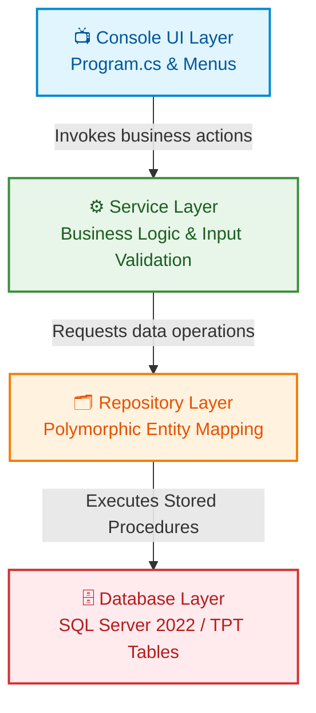

# 🏢 Enterprise Employee & Payroll Management System

> A production-grade console application built with **.NET 8** and **SQL Server 2022**, demonstrating OOP, layered architecture, advanced T-SQL, and disciplined SDLC practice.

[](https://dotnet.microsoft.com/)
[](https://www.microsoft.com/sql-server)
[](https://www.docker.com/)
[](LICENSE)

> **Status:** 🟢 **Database Layer Complete** — Phases 0–7 done · Phases 8–15 in progress

---

## 📑 Table of Contents

- [Project Goals](#-project-goals)
- [Tech Stack](#️-tech-stack)
- [Architecture](#️-architecture)
- [Project Structure](#-project-structure)
- [OOP Concepts](#-oop-concepts--class-hierarchies)
- [Database Design](#️-database-design)
- [Architectural Choices & Trade-Offs](#️-architectural-choices--trade-offs)
- [Stored Procedures](#-stored-procedures)
- [Analytical Queries](#-analytical-queries)
- [Getting Started](#-getting-started)
- [Configuration](#-configuration)
- [Build Roadmap](#-build-roadmap)
- [Lessons Captured](#-lessons-captured-during-development)
- [License](#-license)

---

## 🎯 Project Goals

This project is a focused, 1-day deep-dive intended to solidify and demonstrate:

- **C# / .NET 8** fundamentals in a real, cohesive application
- **Object-Oriented Programming** — Inheritance, Polymorphism, Encapsulation, Abstraction
- **Design patterns** — Factory Method, Repository (planned), Service Layer (planned)
- **SQL Server** proficiency — T-SQL, transactional stored procedures, advanced analytical queries, normalized schema design
- **Layered architecture** — strict separation of Presentation, Service, Repository, Database
- **SDLC discipline** — version control, containerization, atomic commits, documentation as code

---

## 🛠️ Tech Stack

| Layer | Technology |
| --- | --- |
| Language | C# (.NET 8.0) |
| Database | Microsoft SQL Server 2022 (Developer Edition) |
| Data Access | ADO.NET via `Microsoft.Data.SqlClient` v7.0.1 |
| Containerization | Docker + Docker Compose v2 |
| Development Environment | Google Antigravity IDE (Gemini-powered) |
| Version Control | Git + GitHub |
| Host OS | Pop!_OS 24.04 (Ubuntu Noble base) |

---

## 🏗️ Architecture

The application follows a strict layered architecture. Each layer communicates **only** with the one directly beneath it.



**Why strict layering?** It enables independent testing of each tier, easier debugging (each layer has one clear job), and clean evolution of individual concerns. Swap SQL Server for PostgreSQL? Only the Repository layer changes — Models, Services, and UI remain untouched.

---

## 📁 Project Structure

```
EnterprisePayrollSystem/
├── Models/                          # ✅ Domain entities
│   ├── Employee.cs                  # Abstract base class
│   ├── FullTimeEmployee.cs          # Sealed concrete subclass
│   ├── PartTimeEmployee.cs          # Sealed concrete subclass
│   ├── ContractEmployee.cs          # Sealed concrete subclass
│   └── Payroll.cs                   # Immutable record + factory method
├── Repositories/                    # ⬜ Data access layer (pending)
├── Services/                        # ⬜ Business logic layer (pending)
├── Helpers/                         # ⬜ Utilities (pending)
├── Database/                        # ✅ SQL scripts
│   ├── 01_schema.sql                # TPT tables, constraints, indexes
│   ├── 02_seed.sql                  # Test data (6 employees, 4 payrolls)
│   ├── 03_procedures.sql            # 8 transactional stored procedures
│   └── 04_analytical_queries.sql    # 5 reporting queries (CTEs, window fns)
├── docker-compose.yml               # SQL Server container definition
├── dev-up.sh / dev-down.sh          # Container lifecycle scripts
├── EnterprisePayrollSystem.csproj   # Project file (net8.0)
├── Program.cs                       # Entry point + demos
└── README.md                        # This file
```

### File Status & Responsibility Matrix

| Layer | File | Responsibility | Concept Demonstrated | Status |
| --- | --- | --- | --- | :---: |
| **Models** | `Employee.cs` | Abstract base for all employee types | Abstraction | ✅ |
| | `FullTimeEmployee.cs` | Salaried employees with monthly pay | Inheritance + Polymorphism | ✅ |
| | `PartTimeEmployee.cs` | Hourly-paid employees | Inheritance + Polymorphism | ✅ |
| | `ContractEmployee.cs` | Fixed-duration contractors | Inheritance + Polymorphism | ✅ |
| | `Payroll.cs` | Immutable payroll ledger record | Encapsulation + Factory Method | ✅ |
| **Database** | `01_schema.sql` | Idempotent TPT schema creation | Table Per Type mapping | ✅ |
| | `02_seed.sql` | Test data via transactional inserts | `SCOPE_IDENTITY()` pattern | ✅ |
| | `03_procedures.sql` | All CRUD operations | Transactional stored procedures | ✅ |
| | `04_analytical_queries.sql` | Reporting & analytics | CTEs, window functions | ✅ |
| **Repositories** | *(pending)* | ADO.NET data access | Repository Pattern | ⬜ |
| **Services** | *(pending)* | Business logic + validation | Service Layer Pattern | ⬜ |
| **Helpers** | *(pending)* | Cross-cutting utilities | Helper Pattern | ⬜ |

---

## 🧠 OOP Concepts & Class Hierarchies

### Employee Type Class Hierarchy

```text
          ┌──────────────────────────────────────┐
          │  Employee (Abstract Base Class)      │
          │  ────────────────────────────        │
          │  + CalculateGrossSalary()  [abstract]│
          │  + GetEmployeeInfo()       [virtual] │
          │  + ToString()              [override]│
          └──────────────────────────────────────┘
                          ▲
        ┌─────────────────┼─────────────────┐
        │                 │                 │
┌───────────────┐ ┌───────────────┐ ┌───────────────┐
│ FullTime      │ │ PartTime      │ │ Contract      │
│ Employee      │ │ Employee      │ │ Employee      │
│ (sealed)      │ │ (sealed)      │ │ (sealed)      │
│ ─────────     │ │ ─────────     │ │ ─────────     │
│ MonthlySalary │ │ HourlyRate    │ │ ContractAmt   │
│               │ │ HoursPerMonth │ │ ContractEnd   │
└───────────────┘ └───────────────┘ └───────────────┘
   gross =          gross =           gross =
   salary*12        rate*hours*12     contractAmt
```

### OOP Pillar Mapping

| Pillar | Implementation |
| --- | --- |
| **Abstraction** | `Employee` is `abstract`; `CalculateGrossSalary()` is an abstract method — the base defines the contract, subclasses fill in the behavior |
| **Inheritance** | `FullTimeEmployee`, `PartTimeEmployee`, `ContractEmployee` extend `Employee` via `: base(...)` constructor chaining |
| **Polymorphism** | Each subclass overrides `CalculateGrossSalary()` with type-specific math; one `List<Employee>` runs three different calculations transparently via dynamic dispatch |
| **Encapsulation** | All property setters are `private` or `protected`; constructor validates inputs fail-fast before any state assignment |
| **Immutability** | `Payroll` records are frozen after creation — no public setters, no mutator methods |
| **Factory Method** | `Payroll.GenerateFor(employee, payPeriod)` encapsulates the full construction recipe; `Payroll`'s constructor is `private` so the factory is the only entry point |
| **Sealed Concrete Classes** | All three Employee subclasses are `sealed` — locks the hierarchy at the right layer and enables JIT devirtualization |

---

## 🗄️ Database Design

The schema uses the **Table Per Type (TPT)** inheritance mapping strategy and **NO ACTION** referential integrity on payroll history.

### Entity Relationship Diagram

```mermaid
erDiagram
    EMPLOYEES ||--|| FULLTIME_EMPLOYEES : "Is A (EmployeeId)"
    EMPLOYEES ||--|| PARTTIME_EMPLOYEES : "Is A (EmployeeId)"
    EMPLOYEES ||--|| CONTRACT_EMPLOYEES : "Is A (EmployeeId)"
    EMPLOYEES ||--o{ PAYROLLS : "Has (ON DELETE NO ACTION)"

    EMPLOYEES {
        int EmployeeId PK "IDENTITY"
        string FullName "NVARCHAR(150)"
        string Email UK "NVARCHAR(255), UNIQUE"
        string Department "NVARCHAR(100)"
        date HireDate "DATE"
        string EmployeeType "CHECK in (FullTime, PartTime, Contract)"
        datetime CreatedAt "DATETIME2"
        datetime UpdatedAt "DATETIME2"
    }

    FULLTIME_EMPLOYEES {
        int EmployeeId PK_FK "ON DELETE CASCADE"
        decimal MonthlySalary "DECIMAL(18,2), CHECK > 0"
    }

    PARTTIME_EMPLOYEES {
        int EmployeeId PK_FK "ON DELETE CASCADE"
        decimal HourlyRate "DECIMAL(18,2), CHECK > 0"
        int HoursWorkedPerMonth "INT, CHECK 0-200"
    }

    CONTRACT_EMPLOYEES {
        int EmployeeId PK_FK "ON DELETE CASCADE"
        decimal ContractAmount "DECIMAL(18,2), CHECK > 0"
        date ContractEndDate "DATE"
    }

    PAYROLLS {
        int PayrollId PK "IDENTITY"
        int EmployeeId FK "ON DELETE NO ACTION"
        date PayPeriod "DATE"
        decimal GrossSalary "DECIMAL(18,2)"
        decimal TaxDeduction "DECIMAL(18,2)"
        decimal HealthInsuranceDeduction "DECIMAL(18,2)"
        decimal NetSalary "DECIMAL(18,2)"
        datetime GeneratedAt "DATETIME2"
    }
```

### TPT Schema Summary

| Table | Primary Key | Foreign Key | Key Columns | ON DELETE |
| --- | --- | --- | --- | :---: |
| `dbo.Employees` | `EmployeeId` (Identity) | — | `FullName`, `Email`, `Department`, `HireDate`, `EmployeeType` | N/A |
| `dbo.FullTimeEmployees` | `EmployeeId` | → `Employees` | `MonthlySalary` | `CASCADE` |
| `dbo.PartTimeEmployees` | `EmployeeId` | → `Employees` | `HourlyRate`, `HoursWorkedPerMonth` | `CASCADE` |
| `dbo.ContractEmployees` | `EmployeeId` | → `Employees` | `ContractAmount`, `ContractEndDate` | `CASCADE` |
| `dbo.Payrolls` | `PayrollId` (Identity) | → `Employees` | `PayPeriod`, salary breakdown columns | **`NO ACTION`** |

---

## ⚖️ Architectural Choices & Trade-Offs

This project intentionally chose the **more rigorous design path** at several decision points. Each choice has a documented reason and a documented cost.

### 1. Table Per Type (TPT) over Single-Table Inheritance (STI)

**Choice:** Each employee subclass gets its own table sharing a base `Employees` table via `EmployeeId` as PK/FK.

**Why this over STI:**
- No NULL columns — type-specific fields are `NOT NULL` with `CHECK` constraints
- Database-enforced type invariants (e.g., `MonthlySalary > 0` only applies to FullTime)
- Schema mirrors the C# class hierarchy 1:1
- Stronger data integrity at the DB level

**Trade-off:** Every employee read needs a JOIN across base + subclass tables. INSERTs require multi-table transactions. Repository layer must polymorphically map based on the `EmployeeType` discriminator column.

---

### 2. NO ACTION on `Payrolls.EmployeeId` Foreign Key

**Choice:** Deleting an employee with any payroll history is **blocked at the database level** (SQL error 547).

**Why this over CASCADE:**
- Payroll records are legally and operationally immutable
- Real HR/payroll systems must preserve payment history for years (audit, tax, disputes)
- Defense in depth — even buggy app code cannot accidentally destroy financial history

**Trade-off:** `EmployeeService.Delete()` must catch the constraint violation and surface a meaningful domain exception rather than silently failing.

---

### 3. CASCADE on Subclass Foreign Keys

**Choice:** Deleting an employee (when allowed) automatically removes their type-specific subclass row.

**Why:** The subclass row is *part of the employee*, not historical data. If Marco leaves the company AND has no payrolls, his `ContractEmployees` row must die with him. Manual cleanup would be redundant and risk drift.

---

### 4. `THROW;` over `RAISERROR()` for Error Propagation

**Choice:** All stored procedure `CATCH` blocks use the modern `THROW;` statement instead of legacy `RAISERROR()`.

**Why:**
- `THROW;` preserves the original SQL error number (e.g., 547 for FK violation, 2627 for UNIQUE violation), severity, state, and line number
- `RAISERROR()` rethrows under generic user-defined error 50000 — losing the ability to detect specific failures
- Lets the C# application layer pattern-match on `ex.Number == 547` and raise meaningful domain exceptions

**Trade-off:** Requires SQL Server 2012+ (we're on 2022, so trivially satisfied).

---

### 5. `SET NOCOUNT ON` in All Procedures

**Choice:** Every procedure starts with `SET NOCOUNT ON`.

**Why:** Suppresses the `(N rows affected)` DONE_IN_PROC packets that SQL Server sends after every DML statement. These pollute ADO.NET's `SqlDataReader`, waste network bandwidth, and confuse multi-statement procedure execution.

---

### 6. `DECIMAL(18, 2)` for Money — Never FLOAT/REAL

**Choice:** All monetary columns use fixed-point `DECIMAL(18, 2)`.

**Why:** Floating-point types (`FLOAT`, `REAL`) use base-2 approximations that produce rounding errors (e.g., `0.1 + 0.2 = 0.30000000000000004`). For financial calculations, this is unacceptable — audits require absolute mathematical precision to the cent.

---

### 7. `SCOPE_IDENTITY()` — Not `@@IDENTITY`

**Choice:** All identity captures use `SCOPE_IDENTITY()`.

**Why:**
- `@@IDENTITY` is session-wide and can be polluted by triggers on unrelated tables
- `IDENT_CURRENT()` is table-wide but unsafe under concurrent inserts
- `SCOPE_IDENTITY()` is session-scoped, trigger-safe, and concurrency-safe — the only senior-correct choice

---

### 8. `UNION ALL` — Not `UNION` for Subclass Unification

**Choice:** Analytical queries unify the three subclass tables using `UNION ALL`.

**Why:** `UNION` forces a sort-and-deduplicate pass over the combined dataset. Our subclass tables are mutually exclusive by design — duplicates are mathematically impossible. `UNION ALL` skips the wasted work, giving O(n) performance instead of O(n log n).

---

### 9. `CASE WHEN` Range Ordering — Most Restrictive First

**Choice:** Salary band categorization checks `>= 80000` before `>= 40000`.

**Why:** `CASE` expressions short-circuit on the first match. Reversing the order would cause a $93,600 earner to match `>= 40000` first and be misclassified as "Mid Earner." A subtle, silent bug class — always order overlapping range conditions from most restrictive to least restrictive.

---

### 10. Conditional Aggregation over Multiple JOINs

**Choice:** Per-department type breakdown uses `SUM(CASE WHEN EmployeeType = 'X' THEN 1 ELSE 0 END)`.

**Why:** Runs in a single table scan. The naive alternative (three separate JOINs) creates a Cartesian product that degrades dramatically on large datasets. Conditional aggregation is the standard senior idiom for "count rows matching a condition within a group."

---

## 🛠️ Stored Procedures

`Database/03_procedures.sql` contains 8 transactional stored procedures that form the **only** entry point the application uses to interact with the database. No inline SQL allowed in the C# layer.

| # | Procedure | Type | Purpose |
| :---: | --- | --- | --- |
| 1 | `usp_GetAllEmployees` | READ | Returns all employees with TPT JOIN to subclass tables |
| 2 | `usp_GetEmployeeById` | READ | Fetches one employee with full subclass detail |
| 3 | `usp_InsertFullTimeEmployee` | WRITE (Tx) | Atomic insert into Employees + FullTimeEmployees with `OUTPUT` parameter |
| 4 | `usp_InsertPartTimeEmployee` | WRITE (Tx) | Atomic insert into Employees + PartTimeEmployees |
| 5 | `usp_InsertContractEmployee` | WRITE (Tx) | Atomic insert into Employees + ContractEmployees |
| 6 | `usp_DeleteEmployee` | WRITE | Deletes from base — relies on `CASCADE` (subclass) and `NO ACTION` (payrolls) |
| 7 | `usp_InsertPayroll` | WRITE (Tx) | Records a payroll; `UNIQUE` constraint enforces one-per-period |
| 8 | `usp_GetPayrollsByEmployee` | READ | Returns payroll history ordered by `PayPeriod DESC` |

### Common Procedure Skeleton

```sql
CREATE PROCEDURE dbo.usp_XYZ
    @Param INT,
    @NewId INT OUTPUT
AS
BEGIN
    SET NOCOUNT ON;  -- ADO.NET-friendly, suppresses noise packets

    BEGIN TRY
        BEGIN TRANSACTION;
        -- procedure body
        COMMIT TRANSACTION;
    END TRY
    BEGIN CATCH
        IF @@TRANCOUNT > 0 ROLLBACK TRANSACTION;
        THROW;  -- preserves original error number, severity, state, line
    END CATCH
END
```

### Verified Behaviors

- ✅ **Audit integrity**: `usp_DeleteEmployee` against an employee with payrolls returns **error 547** (FK violation)
- ✅ **Duplicate prevention**: `usp_InsertPayroll` with same `(EmployeeId, PayPeriod)` returns **error 2627** (UNIQUE violation)
- ✅ **Transactional atomicity**: All TPT inserts succeed together or roll back together
- ✅ **Cascade cleanup**: Deleting a payroll-free employee removes their subclass row automatically

---

## 📊 Analytical Queries

`Database/04_analytical_queries.sql` contains 5 standalone reporting queries demonstrating advanced T-SQL — meant for ad-hoc analysis, not application runtime.

| # | Query | Techniques Demonstrated |
| :---: | --- | --- |
| 1 | Latest Payroll Per Employee | CTE + `ROW_NUMBER()` window function + `LEFT JOIN` |
| 2 | Salary Ranking Within Department | CTE + `DENSE_RANK()` with `PARTITION BY` |
| 3 | Salary Band Categorization | `UNION ALL` polymorphic unification + `CASE WHEN` categorization + `GROUP BY` |
| 4 | Department Aggregate Report | Conditional aggregation (`SUM(CASE WHEN...)`) + multiple aggregates |
| 5 | Top Earner Per Department Dashboard | Three chained CTEs + JOIN between CTEs + window function |

### Window Function Cheat Sheet

| Function | Tie Behavior | Use Case |
| --- | --- | --- |
| `ROW_NUMBER()` | Each row gets a unique number (arbitrary tiebreak) | "Most recent X per group" |
| `RANK()` | Tied rows share rank, then leave a gap (1, 1, 3, 4...) | "Olympic-style" ranking |
| `DENSE_RANK()` | Tied rows share rank, no gap (1, 1, 2, 3...) | "Top N earners" with tie tolerance |

---

## 🚀 Getting Started

### Prerequisites

- Docker + Docker Compose v2
- .NET 8 SDK
- A SQL client (Azure Data Studio, DBeaver, or `sqlcmd` via container exec)

### 1. Start the database

```bash
./dev-up.sh
# or directly:
docker compose up -d
```

This spins up a SQL Server 2022 container on `localhost:1433` with a persistent named volume `sqldata`.

### 2. Verify the database is reachable

```bash
docker exec -it payroll-sql /opt/mssql-tools18/bin/sqlcmd \
  -S localhost -U sa -P 'YourStrong!Pass123' -C -Q "SELECT @@VERSION"
```

### 3. Apply schema, seed, procedures, and analytical queries

```bash
# Copy all four SQL files into the container
docker cp Database/01_schema.sql            payroll-sql:/tmp/
docker cp Database/02_seed.sql              payroll-sql:/tmp/
docker cp Database/03_procedures.sql        payroll-sql:/tmp/
docker cp Database/04_analytical_queries.sql payroll-sql:/tmp/

# Execute in order
docker exec -it payroll-sql /opt/mssql-tools18/bin/sqlcmd \
  -S localhost -U sa -P 'YourStrong!Pass123' -C -i /tmp/01_schema.sql

docker exec -it payroll-sql /opt/mssql-tools18/bin/sqlcmd \
  -S localhost -U sa -P 'YourStrong!Pass123' -C -i /tmp/02_seed.sql

docker exec -it payroll-sql /opt/mssql-tools18/bin/sqlcmd \
  -S localhost -U sa -P 'YourStrong!Pass123' -C -i /tmp/03_procedures.sql

# Optional — run analytical reports
docker exec -it payroll-sql /opt/mssql-tools18/bin/sqlcmd \
  -S localhost -U sa -P 'YourStrong!Pass123' -C \
  -d PayrollDB -i /tmp/04_analytical_queries.sql
```

### 4. Build and run the application

```bash
dotnet build
dotnet run
```

Currently outputs a colored banner plus polymorphism and payroll-generation demos.

### 5. Stop the database when done

```bash
./dev-down.sh
# or directly:
docker compose down
```

Data persists in the `sqldata` Docker volume between sessions.

---

## 🔐 Configuration

Database connection details are defined in `docker-compose.yml`:

| Setting | Value |
| --- | --- |
| Server | `localhost,1433` |
| Username | `sa` |
| Password | `YourStrong!Pass123` |
| Database | `PayrollDB` |

> ⚠️ The password is hardcoded for **local development only**. Production systems would inject this via environment variables or a secrets manager (Azure Key Vault, AWS Secrets Manager, HashiCorp Vault, etc.).

Connection string used by the application:

```
Server=localhost,1433;Database=PayrollDB;User Id=sa;Password=YourStrong!Pass123;TrustServerCertificate=True;
```

---

## 📊 Build Roadmap

The project is being built in **15 sequential phases**.

### ✅ Completed (7 / 15)

- [x] **Phase 0** — Docker + SQL Server 2022 infrastructure
- [x] **Phase 1** — Project scaffold and folder structure
- [x] **Phase 2** — Abstract `Employee` base class with encapsulation and validation
- [x] **Phase 3** — Concrete subclasses (`FullTime`, `PartTime`, `Contract`) — inheritance + polymorphism
- [x] **Phase 4** — Immutable `Payroll` record with static factory method
- [x] **Phase 5** — SQL schema (TPT) and seed data with audit-grade integrity
- [x] **Phase 6** — 8 stored procedures with `THROW;` error semantics and transactional atomicity
- [x] **Phase 7** — 5 analytical queries demonstrating CTEs, window functions, conditional aggregation

### 🟡 In Progress / Pending (8 / 15)

- [ ] **Phase 8** — `DatabaseHelper` class (ADO.NET wrapper for procedure calls)
- [ ] **Phase 9** — `EmployeeRepository` with TPT-aware polymorphic mapping
- [ ] **Phase 10** — `PayrollRepository`
- [ ] **Phase 11** — `EmployeeService` (validation + business logic + FK exception handling)
- [ ] **Phase 12** — `PayrollService` (salary generation)
- [ ] **Phase 13** — Console menu system
- [ ] **Phase 14** — `Program.cs` wiring + try/catch + logging
- [ ] **Phase 15** — Final polish, README updates, manual testing

**Progress:** `█████████░░░░░░░░░░░ 47%`

---

## 📚 Lessons Captured During Development

### Linux / Shell

- Bash `!` triggers history expansion — passwords containing `!` must be in single-quoted strings or YAML files
- Single quotes `'...'` preserve everything literally; double quotes `"..."` still allow `$` and `!` expansion
- `docker.io` from Ubuntu/Pop repos lags behind official Docker — use `docker-ce` from Docker's apt repo
- Compose v2 (`docker compose`) replaced v1 (`docker-compose`); the plugin must be installed separately on some distros
- After `usermod -aG docker $USER`, must log out and back in for group change to apply
- "Container running" ≠ "service working" — always verify with an actual query (e.g., `sqlcmd SELECT @@VERSION`)
- Systemd manages services: `start`, `enable`, `status` is the trio you'll use for life

### Git Hygiene

- "nothing to commit, working tree clean" means working dir = staging = repo — that's a good state, not an error
- `git reset --soft HEAD~1` — undo commit, keep file changes staged for re-commit
- `git reset --hard HEAD~1` — nuclear: deletes commit AND file changes (irreversible)
- Conventional commit format: `<type>(<scope>): <description>` (feat / fix / docs / chore / refactor / test)

### C# / .NET

- `protected` constructor is the only access level that allows subclass `base(...)` while blocking external instantiation
- Fail-fast validation (validate all → then assign) prevents partial-state objects on exceptions
- `sealed` on concrete leaf classes signals design intent AND enables JIT devirtualization for free perf
- Immutable records (`private` constructor + factory method) prevent calculation drift across a codebase
- Modern C#: file-scoped namespaces, expression-bodied members, string interpolation, `nameof()` in exceptions
- `<Nullable>enable</Nullable>` makes string non-nullable by default — embrace it

### Production-Grade Considerations Flagged In Code

- Email validation via `Contains('@')` is naive — production uses `System.Net.Mail.MailAddress` or rigorous regex
- `DateTime.UtcNow.Date` is timezone-fragile in production — `DateTimeOffset` or `DateOnly` are more robust
- Connection strings hardcoded for local dev only — production uses env vars or secrets managers

### SQL Server / T-SQL

- TPT requires multi-table transactional inserts via `SCOPE_IDENTITY()` for atomicity
- `ON DELETE NO ACTION` on financial-history FKs enforces audit integrity at the database level
- `DECIMAL(18, 2)` is the only correct type for money — `FLOAT`/`REAL` cause base-2 rounding errors
- `THROW;` preserves original error info; `RAISERROR()` flattens everything to error 50000
- `SET NOCOUNT ON` is mandatory in application-consumed stored procedures
- "(N rows affected)" after a SELECT means "rows returned to client" — it does **not** mean data changed
- `UNION ALL` skips the dedup pass that `UNION` performs — use it unless you genuinely need deduplication
- `CASE WHEN` short-circuits on first match — order range conditions most-restrictive first
- `SUM(CASE WHEN cond THEN 1 ELSE 0 END)` is the conditional-aggregation idiom for counting subcategories within groups
- Window functions (`ROW_NUMBER`, `RANK`, `DENSE_RANK`) differ in tie behavior — pick based on intent, not familiarity

### Project Management

- Commit after every successful phase; commit messages should describe **what changed and why**
- Update `README.md` as the project evolves — documentation is not optional, it's a deliverable
- Verify side-effects in databases by reading state, not by trusting "success" messages from clients
- Architectural choices have costs — name them explicitly, document them, defend them

---

## 📄 License

MIT — built for personal learning and portfolio use.

---

<div align="center">

**Built with discipline · Documented with care · Ready for senior review**

</div>